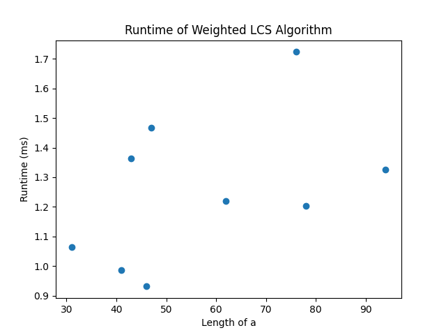
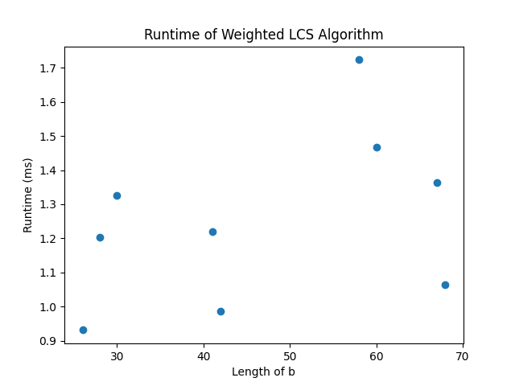
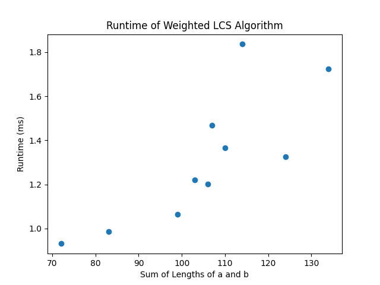
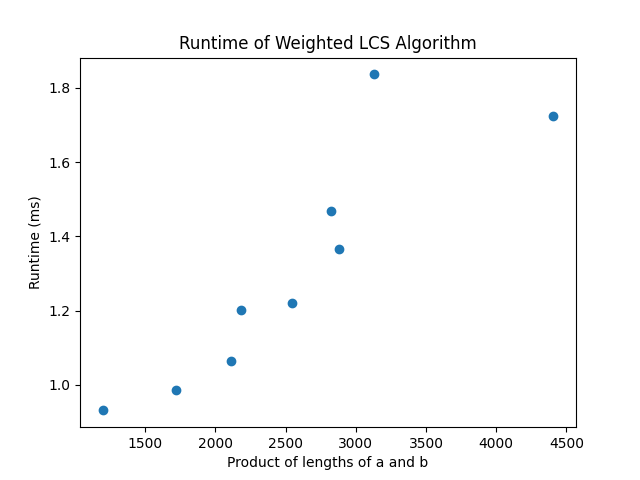
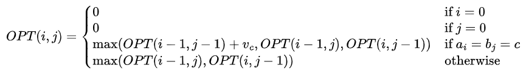

# dynamic-programming
- **Name:** Evelyn Colon
- **UFID:** 46048391

## Project Structure
- `src`: source code for I/O, the DP algorithm, and runtime analysis
- `tests`: input files
    - `nontrivial`: 10 nontrivial example files (lengths of a, b >= 25) gained from running `analysis.py`
    - `small`: 5 small test case files used for my own testing of `main.py`
- `outputs`: output files
    - `nontrivial`: outputs produced from `tests/nontrivial`
    - `small`: outputs produced from `tests/small`
- `plots`: where the plots for my different experiments in written question 1 are located.
- `recurrence_relation.png`: the LaTeX of the recurrence relation I developed for question 2, downloaded as an image to embed in the README. 


## Build/Run Instructions

To run the algorithm on a chosen input file, use the following command structure from the project root:

```bash
python3 src/main.py input_filepath output_filepath
```

If all preconditions are met (see preconditions/assumptions), the HVLCS and its value will be written to the output filepath specified in the command.

### Example Run Command

```bash
python3 src/main.py tests/small/example1.in outputs/small/example1.out
```

## Preconditions/Assumptions:
- The file cannot be empty.
- The first line (k) cannot be empty.
- k > 0.
- The number of lines of alphabet character/value pairs must be equal to k.
- Each character-value pair must contain an alphanumeric character followed by an integer, separated by a space.
- The alphabet cannot be the empty set.
- String A and String B must be nonempty and contain at least one alphanumeric character.
- The alphabet must contain **at least** all of the characters that are contained within the union of A and B, but it may contain more characters.
- Characters in the alphabet may not be repeated.
- No assumptions are made about the lengths of A and B.
- Both an input filepath (relative to the project root) and an output filepath (relative to the project root) must be provided in the order specified in the example commands (see build/run instructions).
- The input file must exist in the filetree at the location specified by the filepath.
- Strings may contain nonalphanumeric characters and whitespace, but all nonalphanumeric characters will be stripped.
- Input/alphabet is treated as case-insensitive. 

## Postconditions:
- The value of the HVLCS and the HVLCS itself are written to the file specified by the output filepath, with each result on a separate line.

## Question 1: Empirical Comparison

### Experiment

The input files used for analysis are located in the directory `tests/nontrivial`, and the corresponding outputs are located in `outputs/nontrivial`. I used a few different comparisons:
- the relationship between the length of a and the runtime, 
- the relationship between the length of b and the runtime, 
- the relationship between the combined length of a and b and the runtime, and 
- the relationship between the product of the lengths of a and b and the runtime.

### Results

The graphs are below:






### Analysis

There appears to be no clear relationship between the length of `A` and the runtime or the length of `B` and the runtime. There appears to be a slightly stronger relationship between the length of `A` + the length of `B` and the runtime, indicating that the runtime is dependent on the size of both input strings. The relationship between the product of the lengths of `A` and `B` and the runtime seems to be a strong linear relationship, which seems to suggest the runtime is in `O(m * n)`, where `m` is the length of `A` and `n` is the length of `B`.

### References

I referred to the following resources to help me formulate test cases for the runtime analysis:
- https://randomwordgenerator.com/ (generate random words for small/trivial cases)
- https://word.tips/unscramble-word-finder/ (find anagrams for the second string in small/trivial cases)
- https://randomwordgenerator.com/sentence.php (random sentences for nontrivial cases)
- https://www.calculatorsoup.com/calculators/statistics/random-number-generator.php (randomly assigned weights for alphabet characters)

## Question 2: Recurrence Relation

### Recurrence Relation for HVLCS



Where $$OPT(i,j) = $$ the value of the common subsequence with maximum value when considering $$a_{1}...a{i}$$ and $$b_{1}...b{j}$$.

I referred to this Reddit post for help formatting the recurrence relation correctly in LaTeX: https://www.reddit.com/r/LaTeX/comments/15wwidi/multiple_lines_in_curly_bracket_i_want_make_the/#:~:text=Comments%20Section,%5C%5D

### Explanation of the Recurrence Relation

There are two base cases in this recurrence relation:
- If the set of characters in `a` being considered is empty, then the maximum value must be zero; this is trivial.
- Likewise, if the set of characters in `b` being considered is empty, then the maximum value must be zero.

Additionally, there are two recursive cases in this recurrence relation:
- If the characters $$a_{i}$$ and $$b_{j}$$ are equal, this means that we can consider adding a new character to the LCS.
- This means there are three possible solutions we can consider to this subproblem:
    - If we add the shared character to the LCS, that means that neither $$a_{i}$$ and $$b_{j}$$ could have been considered before this point; if one of them had, then we would not have a one-to-one pairing if we added the shared character again. Either $$a_{i}$$ would be matched to more than one position in b, or vice versa. Therefore, we add the value of the shared character to the maximum value of a common subsequence in which $$a_{1}...a_{i-1}$$ and $$b_{1}...b_{j-1}$$ are considered. This gives us the first term in the `max` expression on the third line of the recurrence relation.
    - If we choose not to add the shared character, then we have two possibilities which signify that $$OPT(i,j)$$ is basically the same as if we **could not** add the character; essentially, we treat either $$a_{i}$$ or $$b_{j}$$ as though it does not exist in the characters to be considered:
        - $$OPT(i,j)$$ is the maximum value of a common subsequence obtained when considering the first `i-1` characters in `a` and the first `j` characters in `b` (treating $$a_{i}$$ as though it is not available for matching). This gives us the second term in the `max` expression on the third line of the recurrence relation. 
        - $$OPT(i,j)$$ is the maximum value of a common subsequence obtained when considering the first `i` characters in `a` and the first `j-1` characters in `b` (treating $$b_{j}$$ as though it is not available for matching.) This gives us the third term in the `max` expression on the third line of the recurrence equation.
- If $$a_{i}$$ and $$b_{j}$$ are **not** equal, the logic is similar, except now we cannot consider the first possibility described above because we cannot add a new value. The second and third cases remain the same, and those are now the only cases being considered because $$a_{i}$$ and $$b_{j}$$ cannot be matched.

## Question 3: Big-Oh
### Pseudocode
#### Finding the Maximum Value
```plaintext
input: a, b, v (values corresponding to characters in alphabet)
M: solution array
for i in 0...m
    M[i, 0] = 0
for j in 0...n
    M[0, j] = 0

for i in 1...m
    for j in 1...n
        if a[i] = b[j]
            M[i, j] = max(M[i - 1, j - 1] + v[a[i]], M[i - 1, j], M[i, j - 1])
        else
            M[i, j] = max(M[i - 1, j], M[i, j - 1])
return M[m, n]
```

#### Backtracking
The above pseudocode retrieves the value of the HVLCS, but we need to use backtracking to retrieve the actual value of the HVLCS:

```plaintext
lcs = empty string we will use to build the solution
Find-Solution(i, j)
    if i = 0 or j = 0
        return
    if a[i] = b[i] and M[i, j] = M[i - 1, j - 1] + v[a[i]]
        lcs += Find-Solution(i - 1, j - 1) + a[i]
    else if M[i, j] = M[i - 1, j]
        lcs += Find-Solution(i - 1, j)
    else
        lcs += Find-Solution(i, j - 1)
```

The above pseudocode constructs the HVLCS from the solution array `M`.

### Runtime Analysis
The main algorithm (not including backtracking) has two for loops (nested). The outer for loop runs `m` times, and the inner for loop runs `n` times, where `m` is the length of string `a` and `n` is the length of string `b`. Within the inner for loop, subproblem access operations run in `O(1)` because we are simply accessing the solution array `M` for the solutions to previous subproblems. Additionally, computing the maximum of a constant number of subproblems is an `O(1)` operation. Therefore, each iteration of the inner for loop runs in `O(1)`. Therefore, the total runtime for the main algorithm is `O(n*m)`. The backtracking algorithm also accesses each element of the solution array at most once, so it runs in `O(n*m)`. Therefore, the overall algorithm runs in `O(n*m)`.
